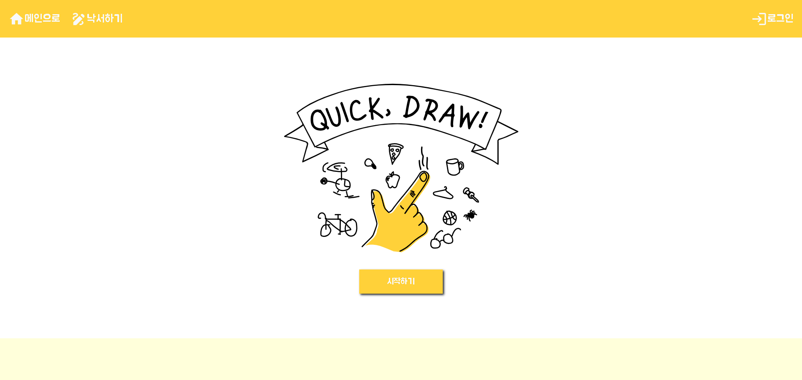

# Quick Draw 프론트엔드

# 1. 개요
Quick Draw 페이지 프론트엔드 작업

# 2. 기획 이유 및 배경
AI는 이미지를 보면 어떻게 인식할까?  
AI의 알고리즘이자 모델인 딥러닝 그 중에서도 이미지 분류에 특화된 CNN이 있다  
CNN을 통해 이미지를 분류하는 간단한 웹 페이지를 구성해보자

# 3. 기능 설명
파이썬 파일과 리액트 파일을 다이렉트로 연결 하여 사용 불가 
- 자바를 통해 파이썬 파일을 실행
- 리액트 웹 페이지에 이미지를 로드하도록 작업

# 4. 코드 리뷰
## categoires.js
다양한 단어를 가짐
getRandomCategory()
  categories 중 하나를 랜덤하게 가져오는 함수

## Direction.js
랜덤 단어를 가져와서 보여줄 부분을 담당

## Canvas.js
캔버스의 베이스를 담당

## Result.js
캔버스에 그린 이미지를 제출할 버튼과 제출후에 일어날 동작을 담당
onRefresh -> 캔버스 초기화 및 새로운 단어 제공 역할

## DrawContainer.js
중복 유형을 방지하는 구조
  el.removeEventListener('mousedown', downHandler);
  el.addEventListener('mousedown', downHandler);

## onConfirmDrawing
- 캔버스에 그려진 이미지를 변환하여 서버로 전송
- const apiHost = process.env.REACT_APP_API_URL 가상환경 호출을 위해 사용
- Result.js의 onRefresh 기능을 정의

# 5. 구현 화면

